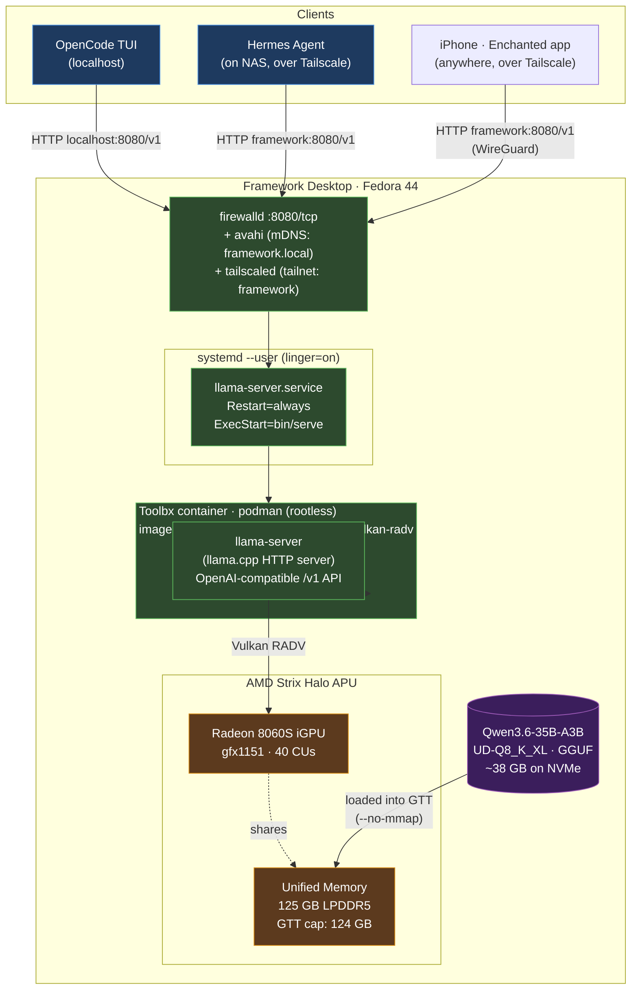

# Architecture

**TL;DR:** Yes, you're using **llama.cpp** — specifically its bundled HTTP server `llama-server` — running inside a Fedora Toolbx container that ships a pre-built llama.cpp + Vulkan stack tuned for AMD Strix Halo. The container talks to your iGPU via Mesa's RADV Vulkan driver. The container is supervised by a systemd user service so it survives reboots and crashes. The model file (Qwen3.6-35B-A3B at Q8) is loaded straight into the iGPU's slice of unified system memory (GTT).

## Diagram



## Layer by layer (bottom up)

### 1. Hardware — AMD Strix Halo APU
- **CPU:** Ryzen AI MAX+ 395 (16c/32t Zen 5)
- **iGPU:** Radeon 8060S (RDNA 3.5, 40 CUs, target `gfx1151`)
- **Memory:** 125 GB LPDDR5, **unified** (shared between CPU and iGPU)

The killer feature is unified memory: the iGPU can address up to **124 GB** of system RAM as "VRAM" (technically called GTT — Graphics Translation Table). On a discrete-GPU setup you'd be limited to whatever the card has. Here you can fit massive models that would otherwise require expensive multi-GPU rigs.

### 2. Kernel boot params (one-time, applied via grubby)
```
amd_iommu=off              # IOMMU disabled — kyuz0 repo flags it as causing instability on Strix Halo
amdgpu.gttsize=126976      # tells amdgpu driver to expose 124 GB GTT (defaults are tiny)
ttm.pages_limit=32505856   # TTM page cap matching the above
```
Without `gttsize`, your iGPU would only see a few GB regardless of how much RAM you have. This is the single most important config on this machine.

### 3. Container — Toolbx (Fedora's container tool) + podman
We use the [kyuz0/amd-strix-halo-toolboxes](https://github.com/kyuz0/amd-strix-halo-toolboxes) `vulkan-radv` image. It's a pre-built Fedora container that ships llama.cpp compiled with the Vulkan backend, plus all GPU userspace bits (Mesa RADV) tested specifically on Strix Halo.

**Why a container instead of installing llama.cpp on the host?**
- Isolates the bleeding-edge graphics stack from your host system
- Someone else (kyuz0) keeps llama.cpp + drivers updated and tested for this exact hardware
- Easy to swap backends (vulkan-radv → rocm-7.2.3) by switching container image
- Host stays a vanilla Fedora install

Container is created once with `setup/05-create-toolbox.sh` and named `llama-vulkan-radv`. Stays around between reboots.

### 4. Inference engine — llama.cpp
**Yes, this is llama.cpp.** Specifically the `llama-server` binary that ships with it — a single-process HTTP server that:
- Loads a GGUF model into memory
- Exposes an **OpenAI-compatible API** at `/v1/chat/completions`, `/v1/models`, etc.
- Handles multiple concurrent requests via "slots" (parallel inference)
- Includes a built-in WebUI at the root URL

Not Ollama, not vLLM, not Open WebUI — just llama.cpp's bundled server. Everything else (model management, monitoring, the systemd unit) is plumbing around it.

### 5. GPU backend — Vulkan via Mesa RADV
llama.cpp supports multiple GPU backends. We chose **Vulkan (RADV)** because:
- RADV is Mesa's mature open-source AMD Vulkan driver — ships with Fedora
- Works on Strix Halo's `gfx1151` today, no ROCm version juggling
- Performance is within ~10% of ROCm on this chip per kyuz0's benchmarks
- More stable on this new silicon

Alternatives the container repo also provides:
- `rocm-7.2.3` (HIP-based, slightly faster gen, less stable)
- `rocm-6.4.4` (older stable HIP)
- `vulkan-amdvlk` (AMD's own Vulkan driver, fastest but 2 GiB buffer limit)

### 6. Model — Qwen3.6-35B-A3B at UD-Q8_K_XL
- **Format:** GGUF (llama.cpp's native quantized model format)
- **Architecture:** Mixture-of-Experts — 35B total parameters, ~3B active per token
- **Size on disk:** 38 GB
- **Quantization:** Unsloth's UD-Q8_K_XL — near-lossless vs full BF16
- **Native context:** 256K tokens
- **Loaded into GTT with `--no-mmap`** so it sits in pinned memory the iGPU can access at full bandwidth

The MoE design means only ~3B parameters fire per token despite the model being 35B total — that's why generation is fast (~80 tok/s) despite the size.

### 7. Process supervision — systemd user service
The `llama-server.service` (in `~/.config/systemd/user/`) wraps the toolbox invocation:
- `Restart=always` — recovers from crashes after 10s
- `Linger=on` (set via `loginctl enable-linger`) — starts at boot **without anyone logged in**
- Logs to `~/.local/share/llama-server.log`

The unit calls `bin/serve`, which sources `config.sh` and runs `toolbox run -c llama-vulkan-radv bash runners/llama-server.sh`. That nested script is what actually invokes `llama-server` with all the right flags.

### 8. Network exposure
- **Bind:** `--host 0.0.0.0 --port 8080` so it's reachable from any network interface
- **Firewall:** `firewall-cmd --add-port=8080/tcp` (permanent) — for LAN access
- **LAN discovery:** `avahi-daemon` advertises this box as `framework.local` via mDNS (with `docker0` excluded so it doesn't broadcast the wrong IP)
- **Tailnet exposure:** `tailscaled` brings up a `tailscale0` WireGuard interface; `0.0.0.0` bind means llama-server is automatically reachable on the tailnet IP (`100.114.x.x`) and MagicDNS name (`framework`). No port forwarding, no public IP exposure.
- **Auth:** none on llama-server itself. Trust model: LAN devices + tailnet devices. Tailscale handles auth/encryption for off-network access.

### 9. Clients
- **OpenCode (TUI)** runs on this same machine, hits `http://127.0.0.1:8080/v1`
- **Hermes agent on the NAS** hits `http://framework:8080/v1` over Tailscale (or `framework.local` over LAN as fallback)
- **iPhone (Enchanted app)** hits `http://framework:8080/v1` over Tailscale — works from cellular / any network
- All use the OpenAI-compatible API surface, so any tool that speaks OpenAI works

## Request flow (one query, end to end)

1. Client sends `POST /v1/chat/completions` to `framework.local:8080` (mDNS → 10.0.0.x via avahi)
2. Linux routing → firewalld accepts on port 8080 → kernel hands TCP to `llama-server` process
3. `llama-server` picks an idle slot (up to 2 concurrent), assembles the chat prompt using the model's Jinja template
4. Model runs on the iGPU via Vulkan: reads weights from GTT, computes attention/feedforward, generates tokens
5. If reasoning is needed (per `--reasoning auto`), thinking goes into `message.reasoning_content`; the final answer into `message.content`
6. If a tool call is appropriate, it's parsed into OpenAI-format `message.tool_calls`
7. Streamed back over HTTP to the client

## Where to look when things break

| Symptom | Check |
|---|---|
| Service not running | `systemctl --user status llama-server` and `tail ~/.local/share/llama-server.log` |
| Can't reach from LAN | `firewall-cmd --list-ports` and `avahi-resolve -n framework.local` |
| OpenCode "context exceeded" | `CONTEXT` and `N_PARALLEL` in `config.sh`; per-slot = CONTEXT / N_PARALLEL |
| Empty responses | `max_tokens` too low (reasoning budget is 2048; request needs 3000+) |
| GPU not actually being used | `amdgpu_top` during a request — GFX should spike to 80%+, SCLK to 2900 MHz |
| GTT memory wrong / too small | `dmesg \| grep GTT` should show 126976M ready; if not, kernel params didn't apply |
| Tool calls not parsed by agent | Run `scripts/test-tools.sh` — if it works locally, agent client expects different format |

## What this is NOT

- Not Ollama (Ollama wraps llama.cpp; we use llama.cpp directly via the toolbox)
- Not LM Studio (see below for why)
- Not running on ROCm (we chose Vulkan for Strix Halo stability — see layer 5)
- Not multi-GPU (single iGPU, but with 124 GB of effective VRAM via unified memory)
- Not auth-protected (LAN trust only — fine on a home network, not for public exposure)

## Why not LM Studio

LM Studio is a great desktop app — model browser, chat UI, one-click HF downloads,
OpenAI-compatible local server. It also uses llama.cpp under the hood, so for a
laptop/desktop user it covers most needs. For *this* machine (headless server
feeding NAS agent + OpenCode + iPhone Enchanted over Tailscale) it's a downgrade:

| Capability here | LM Studio |
|---|---|
| Headless boot via systemd `--user` + `linger=on`, no login needed | Electron GUI app; `lms server` headless mode still wants a user session |
| Strix Halo `gfx1151` via kyuz0 Vulkan-RADV toolbox (host stays vanilla) | Ships bundled runtimes; ROCm on `gfx1151` is the exact thing we avoid |
| Hand-tuned flags chosen to dodge a llama.cpp prompt-cache abort path on this build: `--cache-ram 0 --no-cache-idle-slots --ctx-checkpoints 0 --checkpoint-every-n-tokens -1 --no-mmap --reasoning-budget 2048` | Curated subset in the UI; these specific flags are not exposed |
| Container isolation of bleeding-edge llama.cpp from host | Runs on host |
| `llm-host-control` Express API + GNOME extension + keep-warm timer | None — would need to rebuild |
| `config.sh` in git, reproducible across reinstalls | `~/.lmstudio` JSON, not designed for git workflows |
| Open source stack, no telemetry | Closed source, telemetry, free for personal use only |

What LM Studio would add: model discovery GUI, multi-conversation chat history,
per-model presets, built-in RAG/embeddings scaffolding. The discovery GUI is the
only one that's actually missing here — and `scripts/download-model.sh <repo>
<file>` covers it in one command.

**Best-of-both option:** install LM Studio (x86_64 — not the arm64 AppImage that
landed in `~/Downloads` by mistake) purely as a *client* and point it at
`http://127.0.0.1:8080/v1`. Get the chat UI on top of this server. Don't use it
*as* the server on this hardware.

## ComfyUI — Hardware Compatibility Rules

ComfyUI runs directly on the host (not in Toolbx) via the `comfyui.service`
systemd user service. Point your browser at `http://127.0.0.1:8188`.

### DO NOT use `--force-fp16` with flow-matching models

Models that use **flow-matching diffusion** (ACE-Step, LTX Video, WAN Video)
are trained in bfloat16 and produce **garbage output (noise/pops/silence)** when
forced to float16 on AMD ROCm. The start-up flag `--force-fp16` applies globally
— it will break any flow-matching model loaded through `UNETLoader` regardless
of the node's per-model dtype setting.

**Fix:** remove `--force-fp16` from `systemd/comfyui.service`. Each model then
runs in its stored native dtype. Strix Halo's Radeon 8060S (gfx1151, ROCm 7.2)
supports bfloat16 natively.

```ini
# systemd/comfyui.service — correct launch line:
ExecStart=%h/dev/ComfyUI/.venv/bin/python main.py \
  --listen 127.0.0.1 --port 8188 \
  --disable-mmap --bf16-vae --cache-none \
  --use-pytorch-cross-attention
```

Note: `--force-fp16` is **not** present. `--bf16-vae` is fine (VAEs benefit
from bfloat16 for decode fidelity).

### Model folder mapping

ComfyUI nodes look in specific subdirectories under `models/`. Putting a file
in the wrong folder means it won't appear in dropdowns:

| Node / loader type | Looks in |
|---|---|
| `CheckpointLoaderSimple` | `checkpoints/` |
| `UNETLoader` / `Load Diffusion Model` | `diffusion_models/` |
| `VAELoader` | `vae/` |
| `DualCLIPLoader` | `text_encoders/` |
| `Load Lora` | `loras/` |
| Load upscale model | `upscale_models/` |
| Load latent upscale model | `latent_upscale_models/` |

### ACE-Step 1.5 XL base — known-good settings

Reproduced from the official ComfyUI templates and verified working on this
hardware on 2026-06-18:

| Parameter | Value |
|---|---|
| KSampler `cfg` | 2 |
| KSampler `steps` | 60 |
| KSampler `sampler` | `euler` |
| KSampler `scheduler` | `simple` |
| `ModelSamplingAuraFlow` `shift` | 3 |
| Text encoder `temperature` | 0.85 |
| Text encoder `top_p` | 0.9 |
| Text encoder `top_k` | 0 |

ACE-Step 1.5 uses **different defaults than ACE-Step 1.0** — do not use
cfg=15 (v1 default) on the 1.5 XL model.

### ace15.py text encoder fix

The ComfyUI source file `comfy/text_encoders/ace15.py` shipped a bug where
`yaml.dump(sort_keys=True)` alphabetically scrambled metadata sent to the LM.
This was fixed upstream but if you ever re-clone or re-install, verify line 160
reads `sort_keys=False`. Symptom: generated audio is half the expected duration
and consists of popping sounds regardless of sampler settings.
